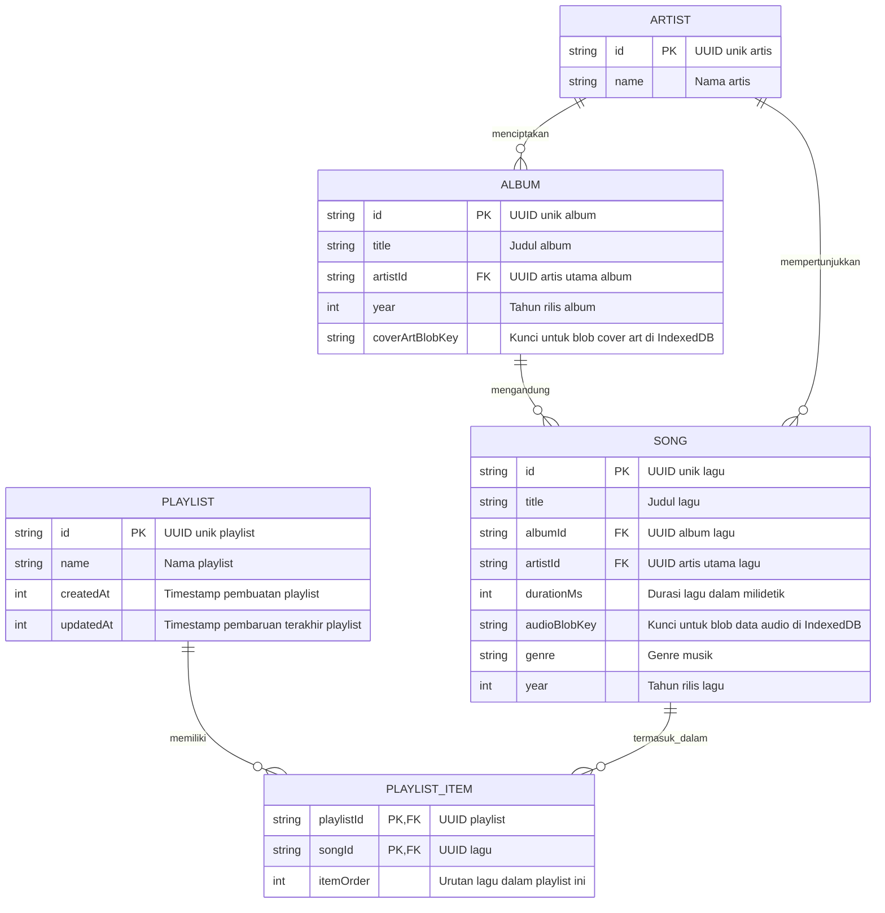

# AGENTS.md — OpenCode & AI Coding Agent Configuration
# Project: LearnDev Generated Spec
# Generated: 20/9/2026, 23.38.11

## CRITICAL EXECUTION RULES
- Read this file BEFORE any code generation.
- NEVER output conversational filler.
- ALL code must be production-grade, zero stubs.
- Use REAL Unsplash CDN URLs for ALL images.

## AGENTS INSTRUCTION & PRD CONTEXT
## OpenCode & AI Coding Agent Protocol

---

# PRD SOURCE DOCUMENT
# Product Requirements Document: Justify PWA Offline Music Player

## 1. Introduction

Justify adalah Progressive Web App (PWA) Offline Music Player yang dirancang untuk memberikan pengalaman pemutaran musik yang andal dan berkualitas tinggi dari file audio lokal pengguna. Aplikasi ini berfokus pada fungsionalitas offline penuh, dukungan format audio yang komprehensif, dan antarmuka pengguna yang responsif serta intuitif di berbagai perangkat. Justify bertujuan untuk menjadi solusi utama bagi pengguna yang mencari pemutar musik yang efisien, privat, dan sepenuhnya fungsional tanpa ketergantungan internet.

## 2. Goals & Objectives

**Primary Goal:**
Menyediakan pengalaman pemutaran musik offline yang berkinerja tinggi dan tangguh untuk file audio lokal pengguna, dengan dukungan format yang luas dan antarmuka pengguna yang adaptif.

**Objectives:**
*   **Kompatibilitas Audio:** Memungkinkan pemutaran bit-perfect untuk beragam format audio (MP3, M4A, FLAC, AAC, WAV, OGG, OPUS, ALAC).
*   **Fungsionalitas Offline Penuh:** Memastikan aplikasi beroperasi sepenuhnya tanpa koneksi internet melalui PWA Service Worker dan penyimpanan data lokal persisten.
*   **Pengalaman Pengguna Responsif:** Menyediakan antarmuka pengguna (UI) yang optimal dan intuitif di desktop, tablet, dan perangkat seluler, mengikuti standar desain "Zero-Revision".
*   **Pemrosesan Audio Lanjutan:** Mengimplementasikan mesin audio berbasis Web Audio API dengan visualizer real-time dan parser metadata yang akurat.
*   **Kode Bersih & Minimalis:** Mengikuti prinsip pengembangan Karpathy untuk codebase yang bersih, mudah dipelihara, dan tanpa over-engineering, didukung oleh dokumentasi struktur file dengan Graphify CLI.

## 3. User Stories

*   Sebagai pengguna, saya ingin mengunggah file musik lokal saya langsung ke Justify agar saya dapat memutarnya kapan saja, bahkan saat offline.
*   Sebagai pengguna, saya ingin Justify memutar berbagai format audio (misalnya, MP3, FLAC, M4A) tanpa masalah kompatibilitas.
*   Sebagai pengguna, saya ingin melihat visualisasi audio real-time (gelombang atau frekuensi) saat lagu diputar untuk pengalaman yang lebih imersif.
*   Sebagai pengguna, saya ingin melihat detail lagu yang lengkap seperti judul, artis, album, dan cover art yang diekstraksi dari metadata file.
*   Sebagai pengguna, saya ingin membuat, mengedit, dan menyimpan playlist saya secara lokal sehingga saya dapat mengatur musik saya sendiri.
*   Sebagai pengguna, saya ingin aplikasi berfungsi dengan lancar dan tanpa gangguan bahkan ketika saya tidak memiliki koneksi internet.
*   Sebagai pengguna, saya ingin dapat menginstal Justify sebagai aplikasi di perangkat saya untuk pengalaman yang lebih terintegrasi dan cepat.
*   Sebagai pengguna, saya ingin antarmuka Justify beradaptasi dengan baik dan terlihat optimal baik saya menggunakan desktop, tablet, atau ponsel.
*   Sebagai pengguna, saya ingin semua elemen interaktif cukup besar dan memberikan umpan balik visual yang jelas saat saya berinteraksi dengannya.

## 4. Features & Functionality

### 4.1. Audio Engine & Processing
*   **Pemutaran Bit-Perfect:** Menggunakan Web Audio API untuk pemutaran audio lokal dengan fidelitas tinggi.
*   **Dukungan Format Komprehensif:** MP3, M4A, FLAC, AAC, WAV, OGG, OPUS, ALAC.
*   **Visualisasi Audio Real-time:** Tampilan visualizer frekuensi dan/atau waveform yang diperbarui secara real-time.
*   **Parser Metadata:** Ekstraksi dan tampilan detail metadata dari tag ID3 (MP3) dan Vorbis (OGG, FLAC) termasuk judul, artis, album, genre, tahun, dan cover art.

### 4.2. PWA & Offline Support
*   **Service Worker:** Mengimplementasikan Service Worker untuk caching aset aplikasi (app shell) dan media yang dipilih pengguna, memastikan operasi penuh tanpa koneksi internet.
*   **Instalasi PWA:** Dukungan untuk instalasi PWA ke layar utama (home screen) perangkat pengguna, menyediakan pengalaman seperti aplikasi native.
*   **Penyimpanan Lokal Persisten:** Menggunakan IndexedDB untuk menyimpan data pengguna (playlist, pengaturan, cache metadata, dan blob audio yang dipilih) secara persisten di perangkat.

### 4.3. Arsitektur Interface (Zero-Revision Standard)
*   **Desktop/Tablet Layout:**
    *   **Multi-panel:** Tata letak dengan beberapa panel yang terorganisir.
    *   **Panel Kiri:** Menampilkan navigasi library musik (artis, album, genre) dan daftar playlist.
    *   **Panel Kanan:** Menampilkan visualizer audio, cover art lagu yang sedang diputar, dan lirik (jika tersedia).
    *   **Sticky Player Bar:** Bar pemutar musik yang selalu terlihat di bagian bawah layar, berisi kontrol pemutaran, progress bar, dan informasi lagu saat ini.
*   **Mobile Responsive Layout:**
    *   **Bottom Navigation Bar:** Bar navigasi utama di bagian bawah layar untuk akses cepat ke bagian utama aplikasi.
    *   **Mini Player Bar:** Bar pemutar mini mengambang di atas navigasi bawah, menyediakan kontrol dasar dan indikator lagu.
*   **Touch Target & States:**
    *   **Ukuran Elemen Interaktif:** Minimal 44x44px untuk semua elemen interaktif (tombol, ikon, dll.) untuk memastikan kemudahan sentuhan.
    *   **Visual State Komprehensif:** Setiap elemen interaktif memiliki visual state yang jelas untuk `hover`, `active`, `disabled`, dan `loading/skeleton` untuk memberikan umpan balik visual kepada pengguna.

### 4.4. Manajemen Perpustakaan & Playlist
*   **Pengelolaan Playlist:** Kemampuan untuk membuat, mengedit, menghapus playlist, serta menambahkan dan menghapus lagu dari playlist.
*   **Browsing Perpustakaan:** Jelajahi musik berdasarkan artis, album, dan genre.
*   **Fungsi Pencarian:** Pencarian cepat dan efisien di seluruh library musik.

## 5. Architecture

```mermaid
graph TD
    User["Pengguna"] -->|"Interaksi Awal"| PWA_Client["Klien PWA (UI & Logika Aplikasi)"]

    PWA_Client -->|"Mendaftarkan & Berkomunikasi"| Service_Worker["Service Worker"]
    Service_Worker -->|"Cache Aset Aplikasi (App Shell)"| Cache_Storage["Cache Storage"]

    User -->|"Memilih File Audio Lokal via"| File_System_Access["File System Access API / <input type=file>"]
    File_System_Access -->|"Menyediakan Data File ke"| PWA_Client

    PWA_Client -->|"Memproses & Menganalisis File"| Metadata_Parser["Modul Parser Metadata (ID3/Vorbis)"]
    Metadata_Parser -->|"Menyimpan Metadata & Referensi ke"| IndexedDB["IndexedDB (Data Lagu, Playlist, Pengaturan)"]
    PWA_Client -->|"Menyimpan Blob Audio untuk Offline di"| IndexedDB

    PWA_Client -->|"Mengambil Data Audio Blob dari"| IndexedDB
    PWA_Client -->|"Memberi Input Data Audio ke"| Web_Audio_API["Web Audio API (Decoding, Pemutaran, Efek)"]
    Web_Audio_API -->|"Menghasilkan Output untuk"| Audio_Visualizer["Visualizer Audio (Canvas)"]

    PWA_Client -->|"Mengelola"| Routing_Nav["Routing & Navigasi Aplikasi"]
    PWA_Client -->|"Merender Layout Responsif"| UI_Components["Komponen UI (Desktop & Mobile)"]
```

## 6. Database Schema

## 7. Technical Specifications

### 7.1. Teknologi Inti
*   **PWA Standards:** Web App Manifest, Service Worker (offline-first strategy), IndexedDB API.
*   **Audio Engine:** Web Audio API untuk decoding, pemutaran, manipulasi audio (gain, analyzer node), dan visualisasi.
*   **Penyimpanan Data:** IndexedDB untuk semua data persisten pengguna: metadata lagu, playlist, pengaturan aplikasi, dan blob audio/cover art.
*   **UI/UX:** HTML5, CSS3 (Flexbox, Grid, Media Queries untuk responsivitas), JavaScript (ESM, async/await). Penggunaan framework JavaScript modern (misalnya, React, Vue, Svelte) direkomendasikan untuk manajemen UI yang efisien dan reaktif.

### 7.2. Dukungan Format Audio
*   MP3, M4A (AAC), FLAC, AAC, WAV, OGG, OPUS, ALAC.

### 7.3. Parsing Metadata
*   Implementasi parser untuk tag ID3v1/v2 (MP3) dan Vorbis Comments (OGG, FLAC) untuk ekstraksi judul, artis, album, genre, tahun, dan cover art. Library pihak ketiga dapat digunakan jika diperlukan (misalnya, `jsmediatags`).

### 7.4. Fungsionalitas Offline
*   **Service Worker:** Akan mencache `app shell` (HTML, CSS, JavaScript, font, ikon) pada instalasi awal.
*   **IndexedDB:** Akan menyimpan metadata lagu, playlist, dan blob data audio yang diunggah pengguna untuk pemutaran offline.

### 7.5. Standar Antarmuka Pengguna
*   **Ukuran Target Sentuh:** Semua elemen interaktif minimal 44x44px.
*   **Visual State:** Setiap elemen interaktif harus memiliki visual state yang jelas untuk `hover` (desktop), `active`/`pressed`, `disabled`, dan `loading/skeleton` (untuk pengalaman pengguna yang mulus selama pemuatan data).
*   **Responsivitas:** Desain responsif menggunakan kombinasi Flexbox, Grid, dan Media Queries untuk menyesuaikan tata letak pada berbagai ukuran layar dan orientasi.

### 7.6. Panduan Eksekusi Codebase
*   **Prinsip Karpathy:** Codebase akan mengikuti prinsip-prinsip pengembangan yang menekankan kejelasan, minimalis, dan efisiensi, menghindari over-engineering dan fokus pada solusi langsung untuk masalah yang ada. Ini mencakup:
    *   Kode harus mudah dibaca dan dipahami.
    *   Setiap bagian kode harus memiliki tujuan yang jelas.
    *   Minimalis dalam dependensi dan fitur yang tidak perlu.
    *   Pengujian unit dan integrasi yang memadai untuk memastikan stabilitas.
*   **Graphify CLI:** Akan diintegrasikan ke dalam alur kerja pengembangan untuk secara otomatis memetakan dan memvisualisasikan struktur file codebase, membantu menjaga keteraturan dan memfasilitasi onboarding bagi pengembang baru.

### 7.7. Performa
*   Optimalisasi pemuatan aset dan kode JavaScript.
*   Lazy loading untuk gambar cover art dan data yang tidak langsung dibutuhkan.
*   Pemanfaatan Web Workers untuk operasi intensif CPU seperti decoding audio yang panjang atau parsing metadata besar, agar UI tetap responsif.
*   Query IndexedDB yang efisien.

## 8. Future Considerations

*   **Sinkronisasi Lintas Perangkat:** Kemampuan untuk menyinkronkan library musik, playlist, dan pengaturan antar perangkat melalui akun pengguna atau protokol P2P.
*   **Integrasi Layanan Eksternal:** Integrasi opsional dengan layanan seperti Last.fm untuk scrobbling atau layanan lirik eksternal.
*   **Equalizer & Efek Audio Lanjutan:** Implementasi equalizer kustom, reverb, atau efek audio lainnya untuk personalisasi pengalaman mendengarkan.
*   **Theming & Kustomisasi:** Opsi untuk mengubah tema visual aplikasi, skema warna, atau tata letak panel.
*   **Dukungan Multi-bahasa:** Ekstensi untuk mendukung berbagai bahasa antarmuka pengguna.
*   **Kontrol Suara:** Kemampuan untuk mengontrol pemutaran atau navigasi menggunakan perintah suara.